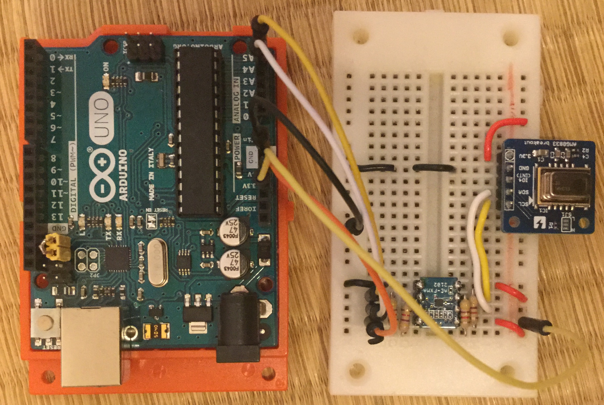

# Thermo-View

サーモグラフィーをArduino経由でブラウザに直結して表示するデモです。

## 用意するもの

- [スイッチサイエンス版 AMG8833モジュール](https://www.switch-science.com/catalog/3395/) x 1
- [Arduino UNO Rev.3](https://www.amazon.co.jp/Arduino-Rev3-ATmega328-%E3%83%9E%E3%82%A4%E3%82%B3%E3%83%B3%E3%83%9C%E3%83%BC%E3%83%89-A000066/dp/B008GRTSV6) と USBケーブル (各1)
- [I2Cバス用双方向電圧レベル変換モジュール(FXMA2102)](http://akizukidenshi.com/catalog/g/gM-05825/) x 1
- ジャンパー線 x 適量(10本くらい)
- 4.7kくらいの抵抗 x 4
- PC (Macでテストしています) x 1

## 1. Arduinoの準備

### 1-1. Arduino IDEの導入

Arduino IDEを初めて使う方は、[ダウンロードページ](https://www.arduino.cc/en/main/software)から、ダウンロードしてインストールしてください。

### 1-2. Arduino UNO への MocoLUFA の導入

最初にArduino UNOに[mocoLUFA](https://github.com/kuwatay/mocolufa)を導入します。
まだ導入されていない方は、[導入手順](https://webmusicdevelopers.appspot.com/arduino-mocolufa/index.html?ja-jp)を参考に導入してください。

### 1-3. ライブラリの導入

下記2つのライブラリを利用します。
Arduinoの`libraries`フォルダに導入後、Arduino IDEを再起動してくささい。

1. [Arduino MIDI Library](https://playground.arduino.cc/Main/MIDILibrary)
2. [adafruit/Adafruit_AMG88xx](https://github.com/adafruit/Adafruit_AMG88xx)

### 1-4. スケッチの書き込み

Arduino UNOへ、[スケッチ](./arduino/amg8833midi/amg8833midi.ino)を書き込んでください。

## 2. 配線

Arduinoの準備が終わったら、写真のように配線してください。
(配線中は、ArduinoとPCをつなぐUSBケーブルは抜いておくこと)

- Arduino [5V] -> FXMA2102 [8]
- Arduino [SDA/A4] -> FXMA2102 [6]
- Arduino [SCL/A5] -> FXMA2102 [7]
- Arduino [GND] -> FXMA2102 [5]
- Arduino [3.3V] -> FXMA2102 [1]
- Arduino [3.3V] -> FXMA2102 [4]
- FXMA2102 [3] -> AMG8833 [SDA]
- FXMA2102 [2] -> AMG8833 [SCL]
- Arduino [3.3V] -> AMG8833 [3.3V]
- Arduino [GND] -> AMG8833 [GND]
- Arduino [5V] -> 抵抗4.7Ω -> FXMA2102 [6]
- Arduino [5V] -> 抵抗4.7Ω -> FXMA2102 [7]
- Arduino [3.3V] -> 抵抗4.7Ω -> FXMA2102 [2]
- Arduino [3.3V] -> 抵抗4.7Ω -> FXMA2102 [3]

配線が終わったら、USBケーブルでArduinoとPCを接続します。

## 3. Webアプリを起動

Google Chrome で下記サイトにアクセスしてください。

[app起動](https://mz4u.net/thermo-view/)

接続したサーモグラフィをストーブなどに向けると赤く表示が変わるはずです。
いろいろ試してみてください！

## ライセンス

CCby4.0

